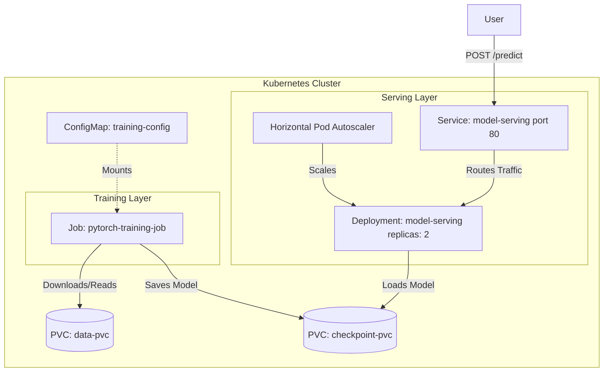

# MLOps PyTorch Pipeline

An end-to-end MLOps pipeline for training and serving a PyTorch image classification model using Docker and Kubernetes.

## Architecture



1.  **Training**: A PyTorch ResNet-18 model trained on CIFAR-10.
2.  **Containerization**: Multi-stage Dockerfiles for optimized training and serving images.
3.  **Orchestration**: Kubernetes manifests for a training Job and a scalable serving Deployment.

## Setup Instructions (Windows PowerShell)

### 1. Build Docker Images

```powershell
# Build training image
docker build -f docker/Dockerfile.train -t mlops-train:v1 .

# Build serving image
docker build -f docker/Dockerfile.serve -t mlops-serve:v1 .
```

### 2. Local Training & Serving (Docker)

```powershell
# Run training with mounted volumes
docker run --rm -v "${PWD}/data:/app/data" -v "${PWD}/checkpoints:/app/checkpoints" mlops-train:v1

# Run serving
docker run --rm -p 8080:8080 -v "${PWD}/checkpoints:/app/checkpoints" mlops-serve:v1
```

### 3. Kubernetes Deployment

```powershell
# Apply namespace and config
kubectl apply -f k8s/namespace.yaml
kubectl apply -f k8s/configmap.yaml

# Run training job
kubectl apply -f k8s/training-job.yaml

# After training completes, deploy serving layer
kubectl apply -f k8s/serving-deployment.yaml
kubectl apply -f k8s/serving-service.yaml
kubectl apply -f k8s/hpa.yaml
```

### 4. Testing the Endpoint

```powershell
# Port-forward for local testing (Open this in a separate PowerShell window)
kubectl port-forward svc/model-serving 8080:80 -n ml-training

# Send a prediction request using curl.exe
curl.exe -X POST http://localhost:8080/predict -F "image=@test_image.png"
```
